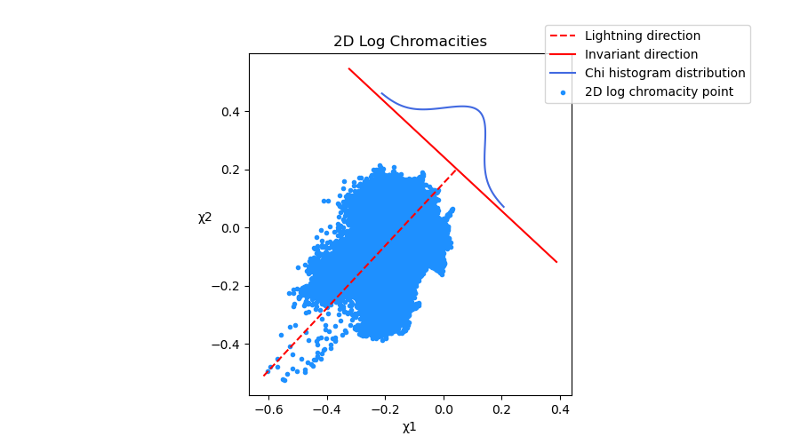

# Shadow removal
This sample contains Python and C++ implementation of articles [[1](#1), [2](#2), [3](#3)] which solves the intrinsic image retrieval problem.
*Intrinsic image* tends to be illumination-invariant and thus contains no shadows.

Original  |  2D Log Chromacities  |  Entropies  |  1D Invariant  
:-------------------------:|:-------------------------:|:-------------------------:|:-------------------------:
  |    |    |  

## References
<a id="1">[1]</a> 
Finlayson, G., Drew, M., Lu, C. (2009). Entropy Minimization for Shadow Removal. Internat. J. Comput. Vision 85, 35–57.

<a id="2">[2]</a> 
G. D. Finlayson, D. M. S, and C. Lu. (2004). Intrinsic images by entropy minimisation. ECCV04.

<a id="3">[3]</a> 
G. Finlayson, S. Hordley, C. Lu and M. Drew. (2006). On the Removal of Shadows From Images. IEEE Transactions on Pattern Analysis and Machine Intelligence.